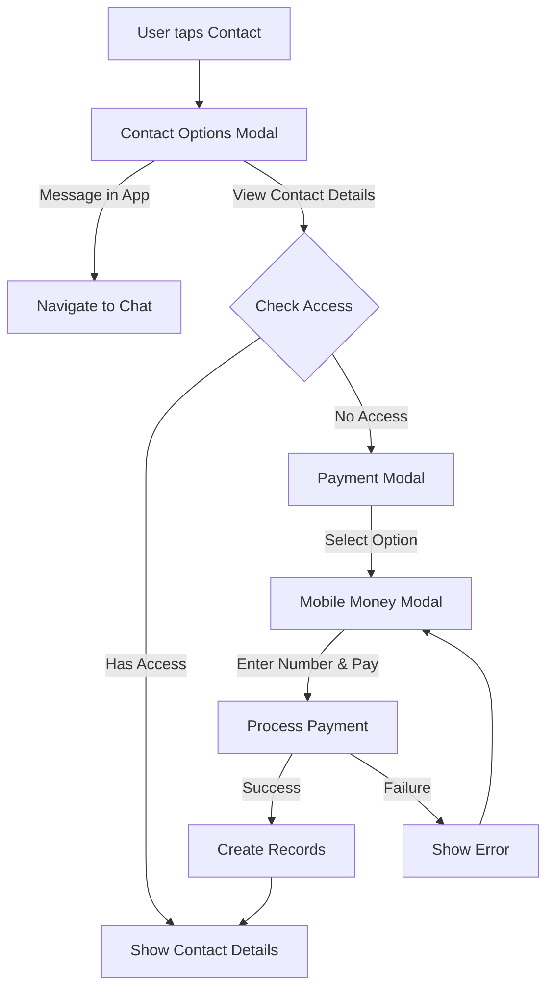
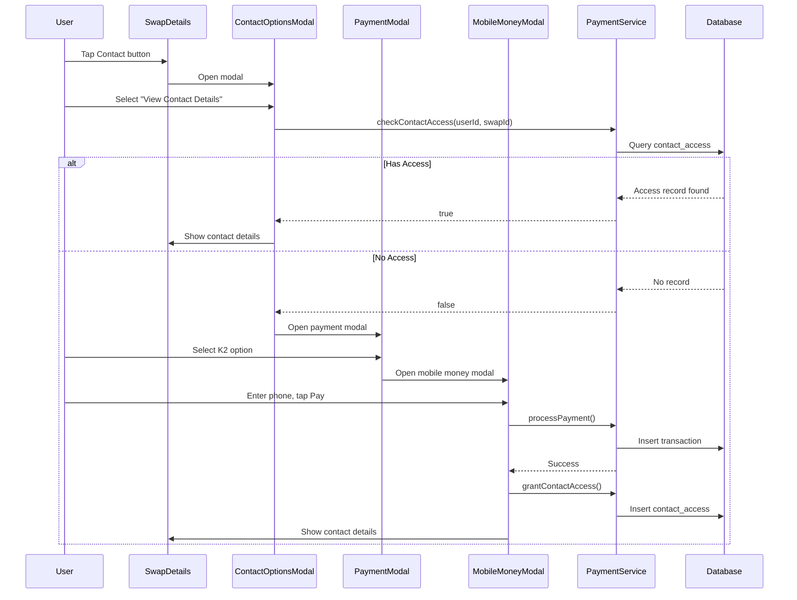

# Design Document: Contact Payment System

## Overview

The contact payment system enables monetization of contact views in the swap application. Users pay to view swap poster contact details through a streamlined bottom modal flow. The system supports single views (K2), packages (K5-K15), and monthly subscriptions (K50). Payment is processed via mobile money with data stored in two database tables.

## Architecture



## Components and Interfaces

### UI Components

1. **ContactOptionsModal** - Bottom modal with "Message in App" and "View Contact Details" options
2. **PaymentModal** - Bottom modal displaying payment tiers (K2, K5, K10, K15, K50)
3. **MobileMoneyModal** - Bottom modal with phone number input and Pay button
4. **ContactDetailsView** - Component displaying phone number and email

### Service Functions

```typescript
// lib/payment.utils.ts
interface PaymentService {
  checkContactAccess(userId: string, swapId: string): Promise<boolean>;
  checkSubscriptionStatus(userId: string): Promise<SubscriptionStatus>;
  getUserViewBalance(userId: string): Promise<number>;
  processPayment(userId: string, amount: number, phoneNumber: string, type: PaymentType): Promise<PaymentResult>;
  grantContactAccess(userId: string, swapId: string): Promise<void>;
  updateViewBalance(userId: string, delta: number): Promise<void>;
}
```


### Types

```typescript
type PaymentType = 'single' | 'package_3' | 'package_6' | 'package_10' | 'subscription';

interface SubscriptionStatus {
  isActive: boolean;
  expiresAt: Date | null;
  daysRemaining: number;
}

interface PaymentResult {
  success: boolean;
  transactionId: string | null;
  error: string | null;
}

interface ContactDetails {
  phoneNumber: string | null;
  email: string | null;
}
```

## Data Models

### transactions Table

```sql
CREATE TABLE transactions (
  id UUID PRIMARY KEY DEFAULT uuid_generate_v4(),
  user_id UUID NOT NULL REFERENCES auth.users(id),
  amount DECIMAL(10,2) NOT NULL,
  payment_type VARCHAR(20) NOT NULL CHECK (payment_type IN ('single', 'package_3', 'package_6', 'package_10', 'subscription')),
  phone_number VARCHAR(20) NOT NULL,
  status VARCHAR(20) NOT NULL DEFAULT 'pending' CHECK (status IN ('pending', 'completed', 'failed')),
  created_at TIMESTAMP WITH TIME ZONE DEFAULT NOW(),
  updated_at TIMESTAMP WITH TIME ZONE DEFAULT NOW()
);

CREATE INDEX idx_transactions_user_id ON transactions(user_id);
CREATE INDEX idx_transactions_status ON transactions(status);
```

### contact_access Table

```sql
CREATE TABLE contact_access (
  id UUID PRIMARY KEY DEFAULT uuid_generate_v4(),
  user_id UUID NOT NULL REFERENCES auth.users(id),
  swap_id UUID NOT NULL REFERENCES swaps(id),
  granted_at TIMESTAMP WITH TIME ZONE DEFAULT NOW(),
  payment_method VARCHAR(20) NOT NULL CHECK (payment_method IN ('single', 'package', 'subscription')),
  UNIQUE(user_id, swap_id)
);

CREATE INDEX idx_contact_access_user_swap ON contact_access(user_id, swap_id);
```

### profiles Table Extension

```sql
ALTER TABLE profiles ADD COLUMN IF NOT EXISTS views_remaining INTEGER DEFAULT 0;
ALTER TABLE profiles ADD COLUMN IF NOT EXISTS subscription_expires_at TIMESTAMP WITH TIME ZONE;
```

## Payment Tiers

| Option | Price | Views | Per-Contact Cost |
|--------|-------|-------|------------------|
| Single | K2 | 1 | K2.00 |
| Package 3 | K5 | 3 | K1.67 |
| Package 6 | K10 | 6 | K1.67 |
| Package 10 | K15 | 10 | K1.50 |
| Subscription | K50/month | Unlimited | - |


## Correctness Properties

*A property is a characteristic or behavior that should hold true across all valid executions of a system-essentially, a formal statement about what the system should do. Properties serve as the bridge between human-readable specifications and machine-verifiable correctness guarantees.*

### Property 1: Paid users get contact access
*For any* user who has a record in contact_access for a specific swap_id, selecting "View Contact Details" should display the contact information without showing the payment modal.
**Validates: Requirements 1.3, 4.2**

### Property 2: Active subscription grants unlimited access
*For any* user whose subscription_expires_at is in the future, selecting "View Contact Details" on any swap should display contact information without payment, regardless of contact_access records.
**Validates: Requirements 2.4, 4.4, 7.3**

### Property 3: Successful payment reveals contact
*For any* payment that returns success=true, the contact details should be displayed immediately and a contact_access record should exist.
**Validates: Requirements 3.5, 8.4**

### Property 4: Transaction status reflects payment outcome
*For any* payment attempt, the transaction record status should be "completed" if payment succeeded, or "failed" if payment failed.
**Validates: Requirements 6.3, 6.4**

### Property 5: Package view decrement invariant
*For any* user with views_remaining > 0 who views a contact using their package, views_remaining should decrease by exactly 1.
**Validates: Requirements 5.2**

### Property 6: Payment creates transaction record
*For any* payment attempt (success or failure), a transaction record should exist with matching user_id, amount, and payment_type.
**Validates: Requirements 6.1**

### Property 7: Contact access persistence
*For any* successful single or package payment for a specific swap, a contact_access record should exist linking user_id to swap_id, and subsequent access checks should return true.
**Validates: Requirements 4.1, 4.3**

### Property 8: Subscription expiry is 30 days
*For any* successful subscription purchase, subscription_expires_at should be set to exactly 30 days from the purchase timestamp.
**Validates: Requirements 7.1**

### Property 9: Expired subscription requires payment
*For any* user whose subscription_expires_at is in the past, selecting "View Contact Details" on a swap without a contact_access record should show the payment modal.
**Validates: Requirements 7.4**

### Property 10: Transaction query returns user's records only
*For any* user_id query on the transactions table, all returned records should have matching user_id.
**Validates: Requirements 6.5**

### Property 11: Valid payment types only
*For any* transaction record, payment_type must be one of: "single", "package_3", "package_6", "package_10", "subscription".
**Validates: Requirements 6.2**


## Error Handling

| Error Scenario | User Message | System Action |
|----------------|--------------|---------------|
| Payment timeout | "Payment timed out. Please try again." | Log error, allow retry |
| Invalid phone number | "Please enter a valid mobile money number" | Prevent submission |
| Insufficient funds | "Payment failed. Please check your balance." | Log transaction as failed |
| Network error | "Connection error. Please try again." | Allow retry |
| Database error | "Something went wrong. Please try again." | Log error, rollback |

## Testing Strategy

### Unit Tests
- Test access check logic with various user states (no access, has access, has subscription)
- Test view balance decrement logic
- Test subscription expiry calculation
- Test payment type validation

### Property-Based Tests
Using fast-check library for property-based testing:

1. **Access check property test** - Generate random users with/without access records, verify correct access decisions
2. **Subscription status property test** - Generate random expiry dates, verify correct active/expired status
3. **View decrement property test** - Generate random starting balances, verify decrement by exactly 1
4. **Transaction recording property test** - Generate random payments, verify transaction records created
5. **Payment type validation test** - Generate random payment types, verify only valid types accepted

### Integration Tests
- Full payment flow from modal open to contact reveal
- Package purchase and subsequent view usage
- Subscription purchase and unlimited access verification

## UI Flow Sequence



## File Structure

```
lib/
  payment.utils.ts       # Payment service functions
  payment.types.ts       # TypeScript types
components/
  payment/
    ContactOptionsModal.tsx
    PaymentModal.tsx
    MobileMoneyModal.tsx
    ContactDetailsView.tsx
```
